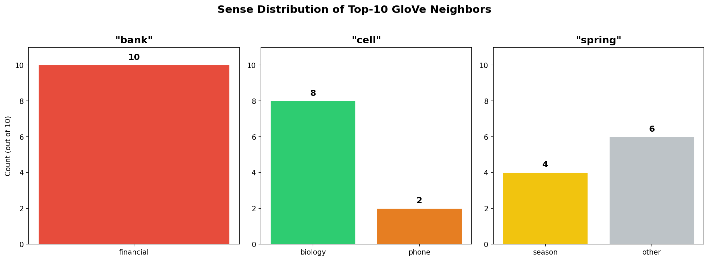
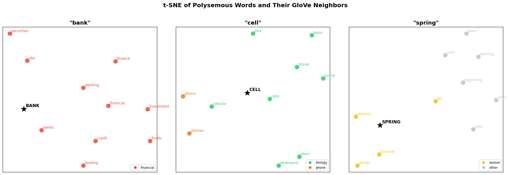

# Experiment 0: Static Embedding Polysemy Probe

**Model:** GloVe 6B, 100d | **Vocab:** 400,000 words

---

## Polysemy Probe: Nearest Neighbors

> **Question:** Do nearest neighbors mix senses? If one sense dominates, why? Can a single static vector cleanly represent a word with multiple distinct meanings?

### `bank` - top 10 neighbors

| Rank | Word | Cosine Sim | Sense |
|------|------|------------|-------|
| 1 | banks | 0.8057 | financial |
| 2 | banking | 0.7531 | financial |
| 3 | credit | 0.7038 | financial |
| 4 | investment | 0.6940 | financial |
| 5 | financial | 0.6777 | financial |
| 6 | securities | 0.6688 | financial |
| 7 | lending | 0.6645 | financial |
| 8 | funds | 0.6485 | financial |
| 9 | ubs | 0.6483 | financial |
| 10 | finance | 0.6462 | financial |

### `cell` - top 10 neighbors

| Rank | Word | Cosine Sim | Sense |
|------|------|------------|-------|
| 1 | cells | 0.8264 | biology |
| 2 | cellular | 0.7098 | biology |
| 3 | brain | 0.6272 | biology |
| 4 | tissue | 0.6194 | biology |
| 5 | embryonic | 0.6118 | biology |
| 6 | phones | 0.6006 | phone |
| 7 | dna | 0.5997 | biology |
| 8 | phone | 0.5957 | phone |
| 9 | stem | 0.5900 | biology |
| 10 | tumor | 0.5860 | biology |

### `spring` - top 10 neighbors

| Rank | Word | Cosine Sim | Sense |
|------|------|------------|-------|
| 1 | summer | 0.8580 | season |
| 2 | autumn | 0.8229 | season |
| 3 | winter | 0.7982 | season |
| 4 | beginning | 0.7359 | other |
| 5 | fall | 0.7181 | season |
| 6 | start | 0.7031 | other |
| 7 | starting | 0.7019 | other |
| 8 | year | 0.6916 | other |
| 9 | next | 0.6878 | other |
| 10 | days | 0.6798 | other |

*Figure 1: Sense composition of top-10 neighbors. `bank` is 100% financial; `cell` shows biology/phone mixing; `spring` splits between season and generic temporal words.*

*Figure 2: t-SNE projection of each target word (star) and its neighbors, colored by sense. `cell`'s phone neighbors visibly separate from biology neighbors; `bank` and `spring` show single-cluster dominance.*

**Observation:** `bank` neighbors are entirely financial with no river/shore sense. `cell` is mostly biology (8/10) but phone sense appears at ranks 6 and 8. `spring` is dominated by the season sense with no water or mechanical spring sense.

**Explanation:** GloVe learns vectors from global co-occurrence statistics. When one sense overwhelmingly dominates the corpus, the final vector is pulled into that sense's region of the embedding space. The co-occurrence signal from minority senses gets diluted and barely surfaces in the neighbor list. `cell` is the only word here showing mixed senses, indicating that both biology and phone contexts appear with sufficient frequency in the training corpus.

---

## Analogy Test

> **Question:** Do static embeddings capture consistent semantic relationships via vector arithmetic, despite failing to separate word senses?

| Analogy | Top Result | Cosine |
|---------|------------|--------|
| `man : woman :: king : ?` | queen | 0.7834 |
| `paris : france :: berlin : ?` | germany | 0.8928 |
| `slow : slower :: fast : ?` | faster | 0.8030 |

**Full analogy results:**

- **man : woman :: king : ?** - queen (0.7834), monarch (0.6934), throne (0.6833), daughter (0.6809), prince (0.6713)
- **paris : france :: berlin : ?** - germany (0.8928), austria (0.7622), denmark (0.7482), poland (0.7455), belgium (0.7062)
- **slow : slower :: fast : ?** - faster (0.8030), quicker (0.6689), pace (0.6581), fastest (0.6316), speeds (0.5992)

**Observation:** Analogy arithmetic works well for words with a single dominant meaning, confirming that vector directions encode stable semantic relationships. However, this relies on each word occupying a clean, unambiguous position in embedding space. For polysemous words like `bank`, the vector sits at a weighted average of its senses, making such arithmetic unreliable.

---

## Summary: Can a single vector encode multiple senses?

> **Question:** What would a model need to produce different vectors for the same word in different contexts?

**No.** A vector is a single point in high-dimensional space. When `bank` has both financial and geographic senses, the vector lands at a weighted average of both sense clusters. In this experiment, the financial sense dominates so heavily that the vector sits inside the financial cluster, and the geographic sense is essentially invisible in the neighbor structure.

A model that produces context-dependent representations needs three components:

1. A static token embedding as the initial input.
2. A contextual encoder (LSTM, Transformer) that mixes information across positions in the sequence.
3. A position-specific output vector, so that `bank` in "river bank" and "bank account" receive different representations.

This is the motivation for moving from static embeddings (Word2Vec, GloVe) toward contextualized models (ELMo, Transformers), which is the central arc of Chapter 1.
