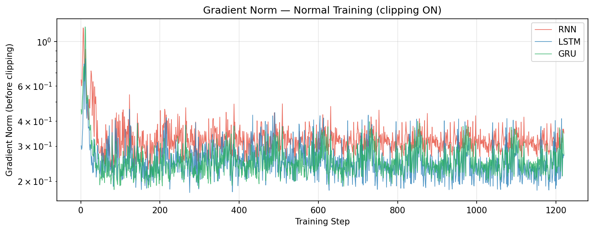
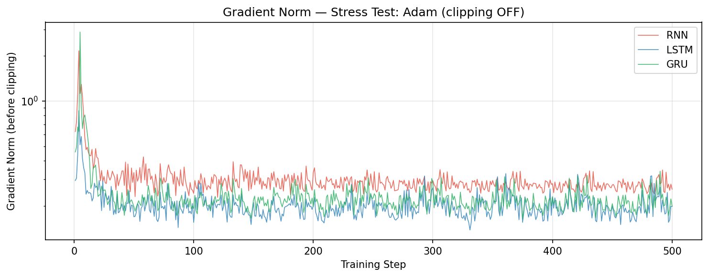
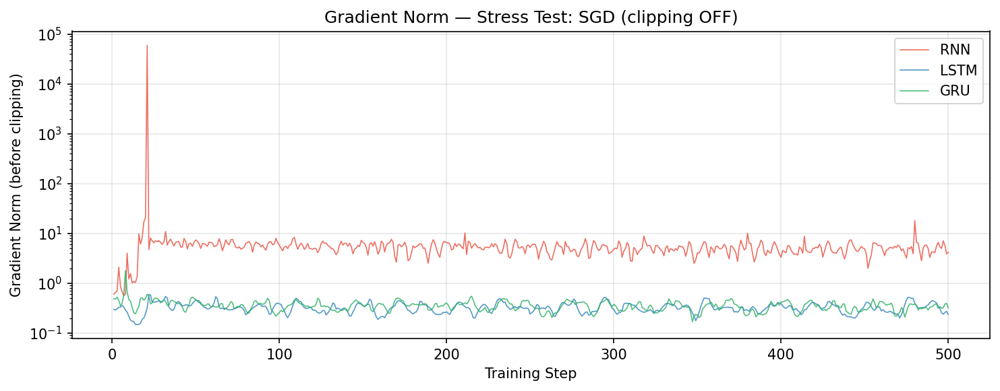

# Experiment 1: Gradient Pathology

> Question: Do vanilla RNNs show worse gradient instability than LSTM/GRU, and how much does the optimizer affect what we observe?

## Normal Training (seq_len=128, lr=1e-3, grad clipping=5.0)

This table checks the ordinary training regime used for the character language model. It establishes whether the three recurrent architectures can train stably when modern safeguards are enabled.

| Model | Final Loss | Avg Grad Norm | Max Grad Norm |
|-------|-----------|---------------|---------------|
| RNN   | 2.0046    | 0.3443        | 1.2721        |
| LSTM  | 1.9871    | 0.2693        | 0.8199        |
| GRU   | 1.9389    | 0.2601        | 1.0841        |

## Stress Test with Adam (seq_len=256, lr=3e-3, NO clipping, 500 steps)

This stress test removes gradient clipping and lengthens the sequence, but keeps Adam. The point is to test whether the classic RNN pathology appears under a common modern optimizer.

| Model | Diverged (NaN)? | Max Grad Norm | Stable? |
|-------|----------------|---------------|---------|
| RNN   | No             | 2.1649        | Yes     |
| LSTM  | No             | 0.8628        | Yes     |
| GRU   | No             | 2.8860        | Yes     |

## Stress Test with SGD (seq_len=256, lr=1.0, NO clipping, 500 steps)

This second stress test uses vanilla SGD to remove Adam's adaptive scaling. This is the cleaner test for exposing exploding gradients in a vanilla RNN.

| Model | Diverged / Unstable? | Max Grad Norm | Stable? |
|-------|----------------------|---------------|---------|
| RNN   | Yes                  | 60240.6194    | No      |
| LSTM  | No                   | 0.5908        | Yes     |
| GRU   | No                   | 1.7883        | Yes     |

## Observations

- Under normal training, all three models are stable with gradient clipping. LSTM and GRU show slightly lower average gradient norms than vanilla RNN.
- The Adam stress test did **not** cause divergence for any model. This is an important negative result: Adam's adaptive second-moment scaling can hide the exploding-gradient behavior that the lab is trying to expose.
- The SGD stress test produced the expected contrast. Vanilla RNN became unstable, with a maximum gradient norm above 60,000, while LSTM and GRU stayed below 2.
- The result does not mean Adam solves long-range memory. It means optimizer choice changes which failure mode is visible. Exp2 still shows that the vanilla RNN fails to preserve information over long distances, while gated models do not.

## Explanation

Vanilla RNN backpropagation repeatedly multiplies gradients by recurrent transition matrices. Over long sequences, this can shrink gradients toward zero or amplify them exponentially. LSTM and GRU introduce gates and additive memory paths that make gradient flow easier to preserve.

Adam changes the observed behavior because it rescales parameter updates using running estimates of gradient magnitude. When gradients spike, Adam often reduces the effective step size for affected parameters. SGD does not do that, so the raw recurrent instability appears much more clearly.
