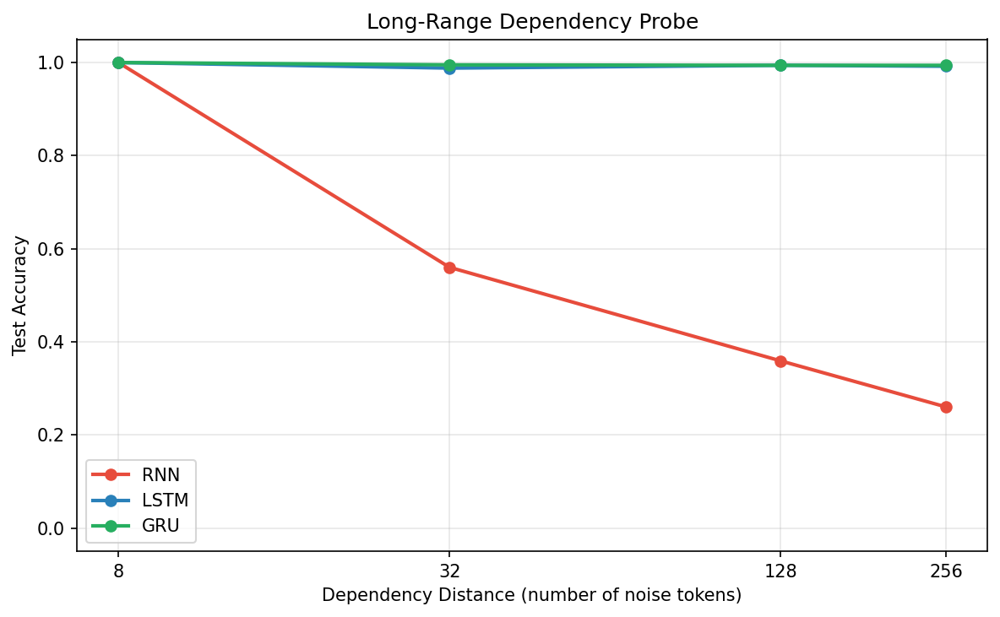

# Experiment 2: Long-Range Dependency Probe

## Question

> Can RNN, LSTM, and GRU models remember a token when the dependency distance grows from 8 to 256 steps?

This experiment isolates long-range memory from language modeling. Each sequence contains a marker, a signal token, random noise, and a query token. The model must predict the original signal after the query. If a model cannot preserve the signal through the noise, accuracy should fall toward random chance.

## Results

| Model | N=8 | N=32 | N=128 | N=256 |
|---|---:|---:|---:|---:|
| RNN | 1.000 | 0.560 | 0.359 | 0.260 |
| LSTM | 1.000 | 0.988 | 0.994 | 0.992 |
| GRU | 1.000 | 0.995 | 0.994 | 0.994 |

## Observation

The vanilla RNN solves the short-distance case but degrades quickly as distance increases. It reaches perfect accuracy at N=8, then falls to 56.0% at N=32, 35.9% at N=128, and 26.0% at N=256. LSTM and GRU stay near perfect across all tested distances.

## Explanation

The result matches the expected failure mode of a vanilla RNN: information must be repeatedly transformed through the same recurrent transition, so the remembered signal decays or becomes overwritten by noise. LSTM and GRU use gates to preserve selected information across time. The LSTM cell state acts as a gradient and memory highway, while the GRU update gate provides a simpler mechanism for retaining prior state. On this task, both gated models keep the signal available even after 256 noise tokens.
