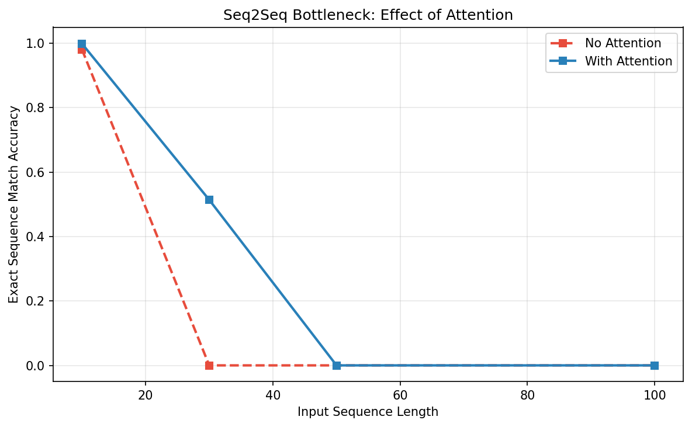
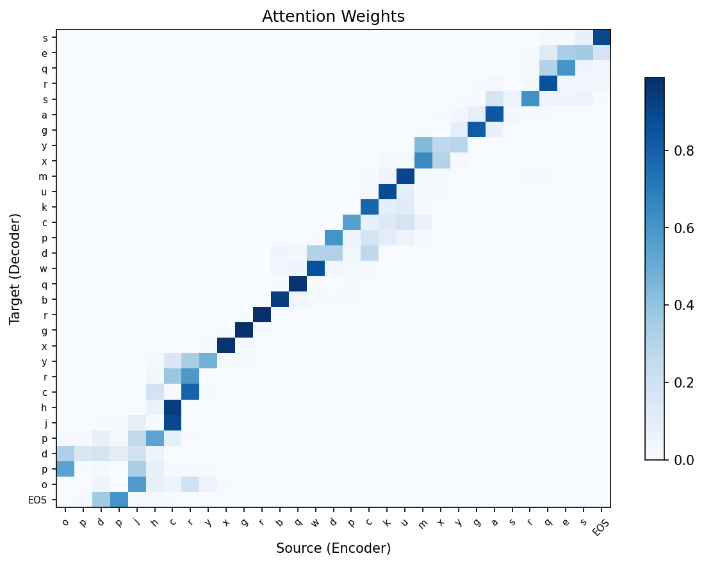

# Experiment 4: Seq2Seq Bottleneck and Attention

## Question

> Does a fixed context vector fail on long input sequences, and does attention reduce that bottleneck?

The reversal task is a direct test of the encoder-decoder bottleneck. To reverse a sequence, the first decoded token depends on the last input token, the second decoded token depends on the second-to-last input token, and so on. A no-attention model must compress all source positions into the final encoder state. An attention model can read from all encoder states during decoding.

## Results

| Model | Length 10 | Length 30 | Length 50 | Length 100 |
|---|---:|---:|---:|---:|
| No attention | 0.981 | 0.000 | 0.000 | 0.000 |
| With attention | 0.999 | 0.514 | 0.000 | 0.000 |

## Observation

The no-attention model succeeds at length 10 but collapses completely at length 30 and above. The attention model reaches near-perfect accuracy at length 10 and improves the length-30 case to 51.4%, but it still fails at lengths 50 and 100 under the current training budget.

The attention heatmap shows the expected anti-diagonal pattern: early decoder steps attend to later encoder positions, and later decoder steps attend to earlier encoder positions. This is exactly the alignment needed for sequence reversal.

## Explanation

The no-attention model demonstrates the fixed-vector bottleneck. As input length grows, the final encoder hidden state must store too many position-specific details, and exact sequence reconstruction fails abruptly. Attention changes the interface between encoder and decoder: instead of forcing every detail through one vector, the decoder receives a learned weighted sum over encoder states at each output step.

The length-50 and length-100 failures should be interpreted as training limitations rather than evidence that attention cannot solve reversal. The clean heatmap shows that the mechanism learned the right alignment at the inspected length, but longer sequences likely need more training, stronger optimization settings, or curriculum learning.
