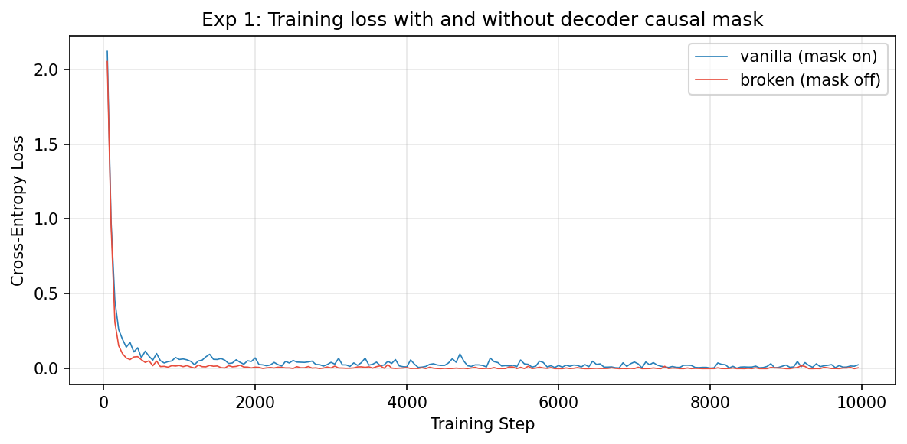
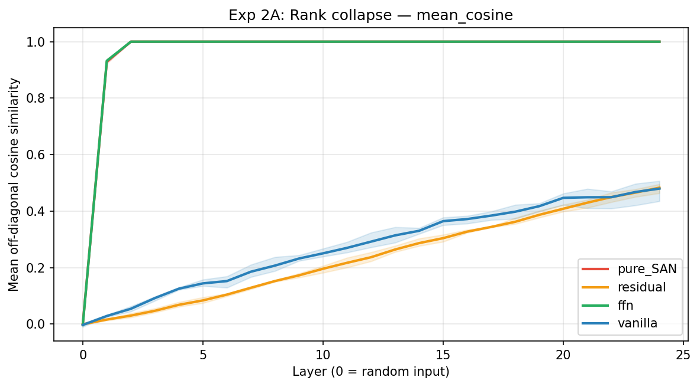
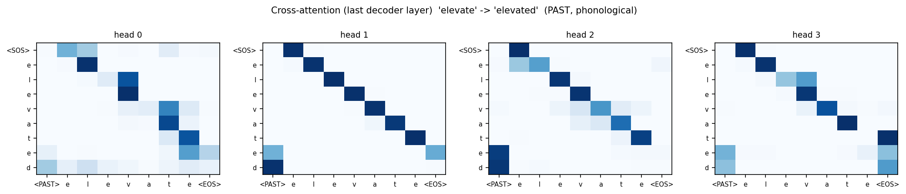
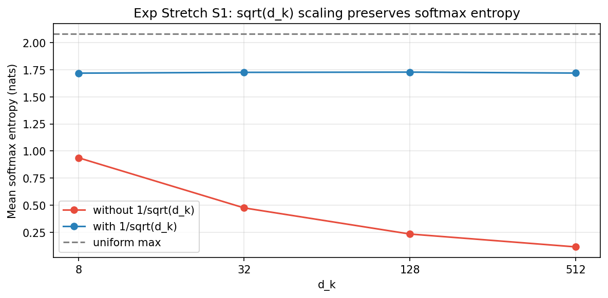

# Lab 2 Synthesis Report: Attention Is Not All You Need

## Question

A vanilla Transformer block has five structural ingredients --- scaled
dot-product attention, causal masking, multi-head projection, positional
encoding, and a per-token feed-forward sublayer wrapped in residual
connections. Each is asserted to be necessary in Ch.2. **Which of them
are actually load-bearing on a real NLP task, and which are easier to
remove than the chapter implies?**

## Setup

The task is English morphological inflection from UniMorph (Sylak-
Glassman 2016), filtered to four high-coverage tags --- PAST, GERUND,
3SG, PLURAL --- balanced to ~19k pairs per tag. Train/val/test split
is hybrid: regular forms by lemma (so the test set probes rule
generalization on unseen lemmas), irregular forms by (lemma, tag) (so
irregular memorization is testable). The model is a Vaswani 2017
encoder-decoder Transformer, 2 enc + 2 dec layers, d_model=128,
4 heads, FFN=512, pre-norm, AdamW lr=3e-4, batch 64, 12-20 epochs per
training run.

## Experiment 0 -- the vanilla ceiling

The unmodified model reaches **97.1% overall** on the validation set,
with 98.5% on pure_regular, 98.1% on phonological, and 42.0% on
irregular. The irregular column is the hardest cell because it
requires per-lemma lookup rather than rule application; every later
ablation should be read against this ceiling, with the irregular
column carrying the most signal.

## Experiment 1 -- the silent bug

Training the same model with `use_causal_mask=False` produces a
striking inversion: the broken model converges to a **lower** training
loss than the vanilla one --- 0.0030 vs.\ 0.0169 --- while greedy-
decoded validation accuracy collapses from 97.1% to **0.0%**.

*Both curves drop fast, but the broken model's loss settles slightly
lower. Without a causal mask, the decoder reads the ground-truth
future during teacher forcing; the optimal solution is to copy the
target one position ahead. At inference time the future does not
exist, and the model produces strings like* `wwwww` *,* `lll`
*, and empty outputs. The training-loss curve cannot detect this
failure.*

This is the cleanest single-bug demonstration in the lab and serves
as a permanent reminder: **a training-loss number alone is not
evidence that a model has learned anything generalizable.** The
verify suite's `no_future_leakage` test catches this in one second.

## Experiment 2 -- rank collapse, in two halves

### Part A: rank collapse at random initialization

Stacking 24 encoder blocks of each ablation configuration and
forwarding a random batch produces the figure below. Token mean
cosine similarity is the cleanest signal: 0 = orthogonal, 1 =
all tokens are the same vector (rank-1 collapsed).

*Reproduction of Dong et al. (2021) Theorem 1 on our model.*
**Pure SAN** *(no residual, no FFN) and* **FFN-only** *(FFN added but
no residual) both saturate to cosine=1.0 by layer 2 --- exactly the
doubly-exponential collapse the theorem predicts. The FFN's per-token
nonlinearity does not prevent collapse on its own.*
**Residual-only** *(residual added but no FFN) and* **vanilla**
*(both) hold cosine below 0.5 across all 24 layers, climbing only
gently with depth.* **Residual, not FFN, is the load-bearing component
for representational diversity.**

### Part B: trained accuracy on the inflection task

Training each ablation configuration end-to-end on the inflection
task produces a four-row accuracy stair:

| config            | pure_regular | phonological | irregular | overall |
|-------------------|-------------:|-------------:|----------:|--------:|
| pure SAN          |       75.5%  |       61.9%  |     1.1%  |  69.4%  |
| **+ residual**    |     **99.0%**|     **96.9%**|   **29.4%**| **96.7%**|
| + FFN only        |       0.0%   |       0.0%   |     0.0%  |   0.0%  |
| vanilla (both)    |       98.5%  |       98.1%  |    42.0%  |  97.1%  |

Three observations:

1. **Pure SAN trains to 75% on pure regulars.** Even with collapsed
   intermediate representations, the decoder's causal self-attention
   plus its final linear projection can memorize the systematic
   regular pattern ("append `-ed` / `-s` after the lemma"). The
   irregular column at 1.1% is the diagnostic --- content lookup is
   impossible without per-position diversity in encoder memory.
2. **FFN without residual collapses to 0%.** The nonlinearity makes
   the gradient pathology worse, not better. This is the lab's
   most surprising single number: **adding the FFN sublayer to a
   model that lacks residual connections is actively harmful**, a
   stronger statement than Dong et al. make explicitly.
3. **Residual alone recovers regulars (99%) but irregulars stay at
   29.4%.** A model that can route attention with stable
   representations can still apply rules; what it cannot do is
   transform one character to another based on lexical identity.
   The irregular gap between 29.4% (residual-only) and 42.0%
   (vanilla) is precisely the per-token nonlinearity that FFN adds.

The two halves together establish: **attention routes; residual
preserves representations through depth; FFN performs per-token
transformation.** Removing any of the three breaks a different aspect
of the system.

## Experiment 3 -- positional encoding, asymmetric

The four PE variants are summarized below:

| variant            | pure_regular | phonological | irregular | overall |
|--------------------|-------------:|-------------:|----------:|--------:|
| enc on, dec on     |       98.5%  |       98.1%  |    42.0%  |  97.1%  |
| **enc off, dec on**|       20.9%  |       25.6%  |     7.6%  |  **22.1%** |
| **enc on, dec off**|       98.0%  |       98.3%  |    33.2%  |  **96.6%** |
| enc off, dec off   |       19.9%  |       24.8%  |     9.2%  |  21.2%  |

Removing encoder PE is catastrophic (97% -> 22%). Removing decoder
PE costs **0.5 percentage points**. This asymmetry surprised us; it
turns out to be a well-documented finding in the literature.

The mechanism is straightforward in hindsight: the decoder uses
**causal self-attention**, so position t can only attend to positions
0..t, and the *count of attendable predecessors* is itself a
positional signal. Each decoder position sees a strictly different
number of context tokens; this difference is enough for the model
to recover absolute position from the mask structure alone. The
encoder, by contrast, is bidirectional --- every position sees every
other --- and is genuinely permutation-equivariant without explicit
PE.

This is exactly the conclusion of **Haviv et al. (2022)**, *Transformer
Language Models without Positional Encodings Still Learn Positional
Information* (EMNLP Findings, arXiv:2203.16634). Their probing
experiments show that decoder-only LMs trained without PE still
encode absolute position throughout the network, and recent work
(Kazemnejad 2023; Chi 2025) traces the geometric mechanism by which
the causal mask induces position-sensitive attention patterns. **Exp
3 is a direct in-the-small reproduction of this result on a different
task.** We promote the Haviv paper to a Core Reading in
`readings/ch02/guide.md`.

## Experiment 4 -- head ablation and specialization

Holding `d_model=128` and varying head count:

| h   | pure_regular | phonological | irregular | overall |
|-----|-------------:|-------------:|----------:|--------:|
| 1   |       98.7%  |       98.3%  |    29.8%  |  97.0%  |
| 4   |       98.5%  |       98.1%  |    42.0%  |  97.1%  |
| 8   |       98.0%  |       98.8%  |    42.0%  |  97.0%  |

The `pure_regular` column is flat across head counts; **all
improvement from h=1 to h=4 is concentrated in the irregular column**
(29.8% -> 42.0%). This is consistent with the per-token-nonlinearity
finding from Exp 2: irregular forms require flexible content
retrieval, and head diversity is exactly what allows different kinds
of retrieval patterns to coexist. The h=4 -> h=8 jump shows no
benefit, validating the "more heads is not always better" note in
Ch.2.

The cross-attention visualization on the trained h=4 model makes
the specialization concrete:

*Each panel is one head; each row is a decoder output position; each
column is an encoder input position (* `<PAST>` *control, characters,*
`<EOS>` *).* **Head 1 is a perfect anti-diagonal copy head** *---
each output character attends to its corresponding source character.*
**Head 3 is a "suffix detection" head** *--- the output characters*
`e` *and* `d` *(the past-tense suffix that does not exist in the
source) attend strongly to* `<PAST>` *and* `<EOS>` *, the only
positions that signal "we are out of source characters and need to
emit the past-tense suffix now."* **Heads 0 and 2 are mixed: copy
behavior with a bias toward suffix positions.** *No two heads do the
same job.*

This is the kind of clean head specialization Vaswani et al.\ (2017)
hypothesized about but is rarely so easy to read off in a small model.
The morphological inflection task creates the conditions for it:
the encoder and decoder share a common character vocabulary, the
output is mostly a copy plus a tail-end edit, and the control token
makes the "what kind of edit" decision explicit and locatable.

## Stretch -- three short probes

The √d_k scaling story is the simplest of the three:

*With the standard 1/√d_k factor (blue), mean softmax entropy stays
constant around 1.72 nats as d_k grows from 8 to 512, close to the
uniform max of 2.08. Without the scaling (red), entropy collapses
from 0.94 to 0.12, an 85% drop --- the softmax has become nearly
one-hot, killing the gradient signal that should flow through it.
This visualizes the central claim of Ch.2 §2.2.3 in a single plot.*

**Wug test** (Berko 1958 productivity probe): the trained vanilla
model achieves **95.5%** on 44 pseudo-words it never saw during
training (PAST 90%, 3SG 100%, GERUND 100%, PLURAL 92.9%). The model
genuinely learned the rules rather than memorizing the training
vocabulary; in linguistic terms, the inflectional paradigm
**generalizes productively**.

**Length generalization**: training was capped at lemma length 10;
slicing val accuracy by length shows 95%+ for every length in
{3, 4, ..., 10}, demonstrating that sinusoidal PE behaves as
advertised --- positions never seen during training are still
correctly represented at inference.

## Synthesis -- which ingredients are actually load-bearing?

Returning to the lab's opening question:

| Ingredient                | Status                                                    | Evidence                       |
|---------------------------|-----------------------------------------------------------|--------------------------------|
| Causal mask (decoder)     | **Load-bearing.** Removing it produces a silent bug --- train loss looks fine, inference is garbage. | Exp 1: 0.0% val acc.           |
| Residual connections      | **Load-bearing across the board.** Removing them causes rank collapse at init and broken training. | Exp 2A; Exp 2B FFN-only row.   |
| FFN sublayer              | **Necessary for content lookup, dispensable for rule application.** Residual-only recovers regulars but loses 12-13 points on irregulars. | Exp 2B residual vs.\ vanilla.  |
| √d_k scaling              | **Necessary for any non-trivial d_k.** Without it, softmax saturates. | Exp Stretch S1.                |
| Encoder positional enc.   | **Load-bearing.** Bidirectional attention is permutation-equivariant. | Exp 3 enc_off rows.            |
| Decoder positional enc.   | **Effectively optional.** Causal mask provides implicit position information. | Exp 3 dec_off rows; Haviv 2022.|
| Multi-head (h > 1)        | **Marginal on this task overall, important for irregulars.** | Exp 4: irregular column.       |

The headline restatement of the chapter: **attention by itself is a
routing operation; it requires (a) a residual highway to preserve
representational diversity through depth, (b) per-token nonlinearity
(FFN) to perform content transformation, (c) explicit positional
information --- but only on sides where attention is bidirectional.**
The Vaswani 2017 design is not "attention" but "attention + four
careful structural choices," and each of the four is justifiable from
a different first principle.

## Next step

The single most informative follow-up would be to **train the
decoder-PE-off model on a task with longer outputs** (where a
character-level decoder must count beyond ~10 positions) and see
whether causal-mask-only positional information starts to fail. This
would tell us whether the Haviv 2022 robustness is a property of the
*architecture* or of the *task regime*. It would also forward-link
neatly into Ch.5's discussion of tokenization (where sequence length
becomes a first-class concern) and Ch.19's discussion of long context.

A smaller but useful follow-up is to **probe what pure-SAN learned
on regulars**, using the Haviv-style linear-probe-for-position
protocol; if pure SAN reaches 75% on regulars despite rank collapse,
something nontrivial is happening in the decoder side that the
diagnostic plot does not capture.
