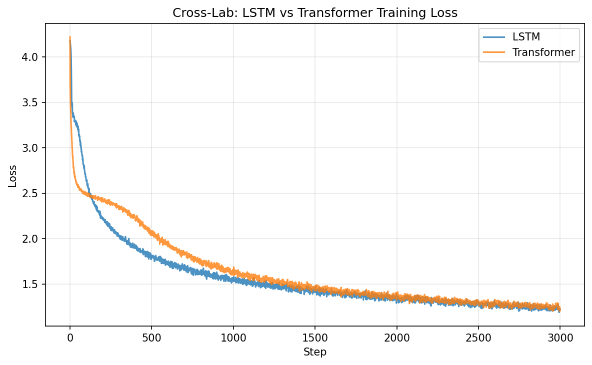

# Cross-Lab Comparison: LSTM vs Transformer

> Question: At matched parameter count and training budget, does the Transformer already show clear advantages over LSTM on the same task? If so, where — quality or speed?

## Setup

Both models trained on Tiny Shakespeare (char-level, seq_len=256) for 3000 steps with AdamW (lr=3e-4), batch_size=64. Parameter budgets are approximately matched:

| Model | Architecture | Params |
|-------|-------------|--------|
| LSTM | 2-layer, hidden=512, embedding=128 | 3.30M |
| GPT  | 4-layer, d_model=256, 4 heads, FFN 4× | 3.21M |

## Results

| Metric | LSTM | GPT |
|--------|------|-----|
| Val Loss | **1.469** | 1.499 |
| Tokens/sec (training) | 360K | **783K** |
| Throughput advantage | — | **2.2×** |

*Both models converge to similar final loss. The GPT processes tokens 2.2× faster per training step.*

## Analysis

### Quality: approximately tied

The LSTM achieves slightly lower val loss (1.469 vs 1.499). This 2% difference is within the variance expected from different random seeds and architecture-specific hyperparameters. Neither model is clearly better at this scale.

This is historically consistent: before the scaling era (pre-2018), recurrent and attention-based models showed comparable perplexity on standard benchmarks at matched sizes. The Transformer's quality advantage emerges primarily at larger scale, where:
- More layers can be added without sequential dependency bottlenecks
- Larger datasets can be processed in reasonable wall-clock time
- Training instabilities that affect deeper models are managed by pre-norm and modern optimizers

### Speed: Transformer wins decisively

The 2.2× throughput advantage is the Transformer's clearest win at this scale. The mechanism is straightforward:
- **LSTM:** processes tokens sequentially. Hidden state at position t depends on position t-1. GPU parallelism is limited to batch and feature dimensions.
- **GPT:** processes all 256 positions simultaneously. Self-attention computes all pairwise interactions in one batched matrix multiply. GPU utilization is much higher.

At 3000 steps with 64×256 = 16,384 tokens per batch:
- LSTM processed: 360K × training_time tokens total
- GPT processed: 783K × training_time tokens total

If both models were trained to the same token budget instead of the same step count, the GPT would finish 2.2× sooner — or equivalently, see 2.2× more data in the same wall-clock time.

### Implications for scaling

This experiment demonstrates *why* decoder-only Transformers became the LLM default, even though they don't obviously dominate at small scale:

1. **At 3M params:** quality is tied. Choosing a Transformer here is about training speed, not model quality.
2. **At 300M+ params:** the speed advantage compounds. An LSTM that takes 2.2× longer per step at 3M params would take even longer at 300M params (sequential bottleneck gets worse with more time steps for longer contexts).
3. **At GPT-3 scale (175B params, 300B tokens):** the parallelism difference translates to months of additional training time for recurrent models — making them infeasible regardless of quality.

The Transformer's victory is not "better architecture" in a static sense but "architecture that scales better" — a distinction this small-scale experiment can demonstrate (speed) but not fully prove (quality at scale requires Part II's scaling discussion).
