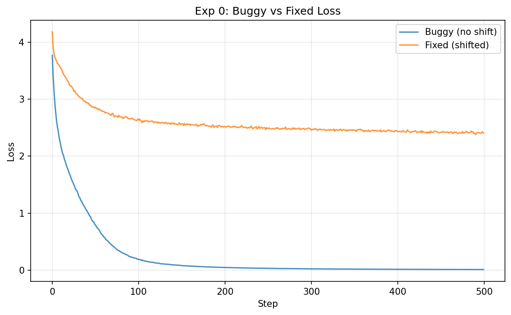

# Experiment 0: Shifted-Label Bug Hunt

> Question: Can a model appear well-trained (low loss) while being fundamentally broken? What does the shifted-label alignment actually do?

## The Bug

The deliberate bug computes cross-entropy between `logits[:, :, :]` and `input_ids[:, :, :]` — predicting the *current* token from its own position rather than the *next* token. This turns language modeling into a trivial copy task.

## Results

| Config | Val Loss | Generation |
|--------|----------|-----------|
| Buggy (no shift) | **0.0077** | `ROMEO:::::::::IIIIIIIII...tttttttt` |
| Fixed (shifted)  | 2.3859     | `ROMEO:\nHe me toant, ine dn athYow y:` |


*Both converge, but the buggy model achieves artificially low loss on a trivial objective.*

## Generated Samples

**Buggy model (500 steps):**
```
ROMEO:::::::::::::::::::::::::::::::::::::::::::::::::::::::::::::::::::::
IIIIIIIIIIIIIIIIIIIIIIIIIIIIIIIIIIIItttttttttttttt
```

**Fixed model (500 steps):**
```
ROMEO:
He me toant, ine dn athYow y:
Lod Yor tanil aru ogiu th be, vart, co earof ot:
'l ar cha owolanceng te? ld rmase was pasand, d t ssou, rilores, thyor siemy f su stive osolond.
```

## Diagnosis

The buggy model achieves val loss 0.0077 because it learns to copy the embedding → logit pathway (trivial with weight tying). The generated text is garbage because at inference time, the model has no ground-truth current token to copy — it must predict what comes next, which it never learned to do.

The fixed model's loss (2.38) is much higher because next-token prediction is genuinely hard. But its generation shows rudimentary English structure even after only 500 steps.

**Lesson:** This is structurally identical to Lab 2's causal mask bug. In both cases:
- Training loss looks good (or impossibly good)
- The model has access to information it shouldn't
- Generation / inference fails completely
- The fix requires enforcing proper temporal alignment

The off-by-one label shift is not an implementation detail — it *is* the language modeling objective. Without it, the model solves a different (trivial) task.
