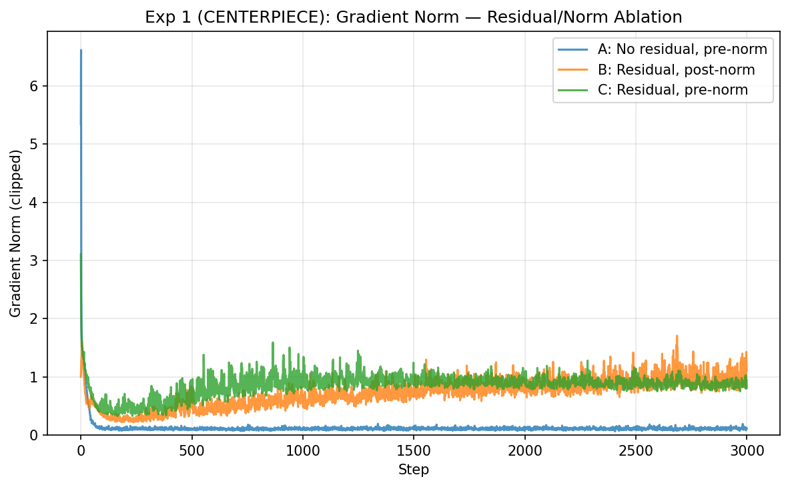
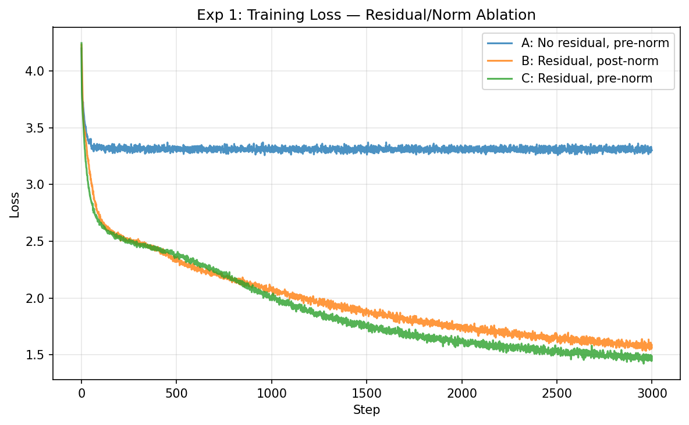

# Experiment 1: Residual Stream and Normalization (CENTERPIECE)

> Question: What makes an 8-layer decoder-only Transformer trainable? Is the residual stream merely convenient, or structurally necessary?

## Setup

Three 8-layer GPTs (d_model=128, 4 heads, ~1.6M params each), trained for 3000 steps on Tiny Shakespeare (char-level). The only difference is residual/norm configuration.

## Results

| Config | Val Loss | Final Train Loss | Generation Quality |
|--------|----------|-----------------|-------------------|
| A: No residual, pre-norm | 3.35 | 3.30 | Scrambled: `snhte eaYlh\np oes shtt` |
| B: Residual, post-norm   | 1.68 | 1.56 | Words visible: `That thou Maker you Corisius` |
| C: Residual, pre-norm    | **1.57** | **1.49** | Coherent: `Be bound be to marriage! I am long thy mother.` |


*Config A shows elevated, erratic gradient norms. Config C is the most stable.*


*Config A barely descends from random baseline (ln(65)≈4.17). Config C achieves smooth, lowest loss.*

## Generated Samples

**Config A (no residual):**
```
ROMEO:snhte eaYlh
p oes shtt   eDn-,io'a,eaK':Dveidtllld: d yh uas h: ubi
R,hsnssnopihTtrie  a rEitu
```

**Config B (residual, post-norm):**
```
ROMEO:
That thou Maker you Corisius,
Which son hour exply and truving toget
It in the quaid soveil r
```

**Config C (residual, pre-norm):**
```
ROMEO:
Be bound be to marriage! I am long thy mother.

BALTHASAS:
O, if you to be me a do my hoursel
```

## Diagnosis

**Config A (no residual):** The model barely trains. Val loss 3.35 represents only marginal improvement over the random baseline of ~4.17. This is an 8-layer network where each layer's output must be the *sole* input to the next layer — no skip connection preserves information from earlier layers. Gradient flow through 8 multiplicative transformations degrades, and the model cannot learn meaningful representations.

**Config B (post-norm):** Adding residual connections immediately recovers trainability (val loss 1.68). Post-norm places LayerNorm *after* the residual addition: `LN(x + sublayer(x))`. This works but places the normalization on the "main path," which can cause gradient scale issues at depth.

**Config C (pre-norm):** Pre-norm places LayerNorm *before* the sublayer: `x + sublayer(LN(x))`. The residual stream itself passes through unchanged, and normalization only affects what goes *into* each sublayer. This keeps gradient magnitudes more consistent through depth, producing the smoothest training curve and lowest loss.

## The Parallel with Lab 1

| | Lab 1 | Lab 3 |
|---|---|---|
| **Problem** | Gradient explosion through time | Gradient degradation through depth |
| **Broken config** | Vanilla RNN (max grad norm 60,240) | No residual (val loss 3.35) |
| **Fixed config** | LSTM with cell state (max grad norm 0.59) | Pre-norm with residual (val loss 1.57) |
| **Mechanism** | Cell state = additive highway through time | Residual stream = additive highway through layers |

The structural parallel is precise: both LSTM cell state and Transformer residual stream provide an additive path that gradients can flow through without repeated multiplication. This is why both architectures can be stacked deep (LSTM: many time steps; Transformer: many layers) while vanilla RNNs and no-residual Transformers cannot.
