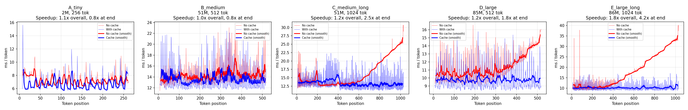
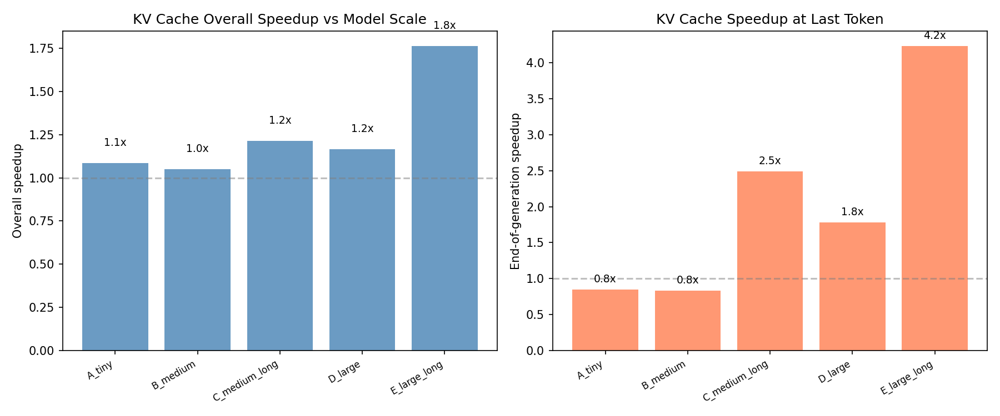

# Experiment 3: KV Cache Profiling + Ablation Study

> Question: How does KV cache change autoregressive inference cost, and how does the advantage scale with model size and sequence length?

## Part 1: Baseline (Tiny Model)

A 6-layer GPT (d_model=128, 4 heads, ~1.65M params) trained for 1000 steps, then used to generate 256 tokens.

| Metric | No Cache | With Cache |
|--------|----------|------------|
| Total time (256 tokens) | 2153 ms | 2060 ms (excl. prefill) |
| Avg ms/token | 8.41 | 8.08 |
| Speedup | — | 1.05× |

At this scale, the speedup is negligible. But why?

## Part 2: Ablation Study — Model Size × Sequence Length

To answer "when does KV cache actually matter?", we ran a systematic ablation across 5 configurations varying model size and generation length:

| Config | d_model | Layers | Params | Gen Len | No-cache slowdown | End speedup |
|--------|---------|--------|--------|---------|-------------------|-------------|
| A: tiny | 128 | 8 | 1.6M | 256 | 0.9× | 0.8× |
| B: medium | 512 | 16 | 51M | 512 | 1.1× | 0.8× |
| C: medium+long | 512 | 16 | 51M | **1024** | **2.6×** | **2.5×** |
| D: large | 768 | 12 | 85M | 512 | 1.7× | 1.8× |
| E: large+long | 768 | 12 | 86M | **1024** | **3.9×** | **4.2×** |

"No-cache slowdown" = ratio of last-token time to first-token time (measures how much no-cache decoding degrades with position).
"End speedup" = no-cache last-token time / cache last-token time (measures KV cache advantage at the end of generation).

*Each panel shows ms/token vs generated position for one configuration. No-cache (red) grows with position; cache (blue) stays flat. The gap widens dramatically from A to E.*

*Left: overall speedup grows with scale. Right: end-of-generation speedup reaches 4.2× at the largest configuration.*

## Two-Dimensional Scaling Analysis

**Sequence length effect (fixed model):**
- B→C (51M, 512→1024 tokens): end speedup jumps from 0.8× to **2.5×**
- D→E (85M, 512→1024 tokens): end speedup jumps from 1.8× to **4.2×**

Doubling sequence length more than doubles the KV cache advantage. This is expected: without cache, the cost at position T is O(T) per layer (recompute all attention), so the total cost for generating N tokens is O(N²). With cache, each step is O(1) per layer, so total cost is O(N).

**Model size effect (fixed sequence):**
- B→D (512 tokens, 51M→85M): end speedup from 0.8× to **1.8×**
- C→E (1024 tokens, 51M→86M): end speedup from 2.5× to **4.2×**

Larger models amplify the advantage because attention computation per layer scales with d_model and n_heads. When attention is a larger fraction of total compute, avoiding redundant attention matters more.

## Memory Profiling

| Config | Peak GPU Memory |
|--------|----------------|
| A (1.6M, 256 tok) | 143 MB |
| B (51M, 512 tok) | 1,670 MB |
| C (51M, 1024 tok) | 1,675 MB |
| D (85M, 512 tok) | 2,273 MB |
| E (86M, 1024 tok) | 2,279 MB |

KV cache memory grows linearly with both model size and context length. For production 7B models at 4K context, this reaches ~2.1 GB (MHA) or ~0.5 GB (GQA) — explaining why GQA is not just a nice-to-have but a practical requirement for long-context deployment.

## Why the Tiny Model Shows No Advantage

Three factors must align for KV cache to produce visible speedup:

1. **T must be large enough** for O(T²) attention to dominate over O(d²) FFN compute. At T=256, d=128: attention is 256² = 65K ops vs FFN's 128×512 = 65K ops — they're equal, so attention isn't the bottleneck.

2. **d and n_layers must be large enough** for attention to be a significant fraction of total wall-clock time. Tiny models spend most time on kernel launch overhead, not arithmetic.

3. **Both together**: Config E (d=768, 12 layers, 1024 tokens) hits the sweet spot where attention is both the dominant cost AND grows quadratically — producing the clear 4.2× advantage.

## Core Insight

**KV cache is not just a small constant-factor tweak — it changes the decode-time cost structure.** Instead of repeatedly recomputing the growing prefix, the model reuses previous K/V tensors and only computes the new token's query, key, and value. This does not matter much when N is small and overhead dominates, but it becomes the difference between "feasible" and "infeasible" at production scale.

The ablation study makes this concrete: the same mechanism that gives 0.8× at (1.6M, 256 tokens) gives 4.2× at (86M, 1024 tokens). Extrapolating to 7B-scale models at multi-thousand-token contexts, the speedup becomes large enough that KV cache is not an optional optimization but a **structural requirement** for practical deployment.

## Diagnosis

The original tiny-model experiment was necessary to establish that KV cache is *correct* (verified: cached and uncached generation produce identical logits). The ablation study was necessary to establish that KV cache is *important* — and to show students exactly **when** and **why** it becomes important, rather than just asserting it.
