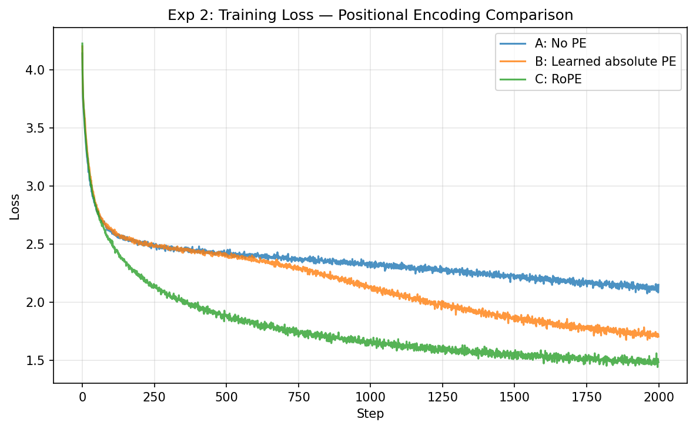

# Lab 3 Report: What Holds a GPT Together

## Question

A decoder-only Transformer is built from familiar components — attention,
residual connections, layer normalization, positional encoding, and a
shifted next-token objective. Chapter 3 claims these are not just
convenient engineering choices but structurally load-bearing. **Which
architectural features make a decoder-only model correct, trainable,
and efficient — and what breaks when each is removed?**

## Setup

The task is character-level language modeling on Tiny Shakespeare (~1.1M
characters, 65-character vocabulary). All experiments use a small GPT:
d_model=128, 4 heads, 8 layers, FFN expansion 4×, ~1.6M parameters.
Training uses AdamW (lr=3e-4, weight_decay=0.01) for 3000 steps,
batch_size=64, seq_len=256. The model is deliberately small so that
ablations complete quickly and architectural effects are not hidden by
capacity.

## Experiment 0 — the shifted-label bug hunt

The model was first run with a deliberately broken loss function that
computes cross-entropy between logits and the *current* token (no shift),
then re-run with the correctly shifted objective.

| Config | Val Loss | Generation Quality |
|--------|----------|-------------------|
| Buggy (no shift) | **0.0077** | Repeating characters: `:::::IIIIII` |
| Fixed (shifted)  | 2.3859     | Proto-English: "He me toant, ine dn ath..." |

*Figure 1: Both models converge, but the buggy model solves a trivial
copy task (predict the token you already see). The fixed model solves
the real next-token prediction task.*

The buggy loss is 300× lower, but generation is garbage. This is the
same pattern as Lab 2's causal mask bug: **low training loss is not
evidence of a correct model.** The shifted-label alignment is
structurally load-bearing for the language modeling objective — without
it, the model trivially copies input to output with near-zero loss,
and the training signal teaches nothing useful.

## Experiment 1 — residual stream and normalization (CENTERPIECE)

Three 8-layer models, identical except for residual/norm configuration:

| Config | Val Loss | Generation Quality |
|--------|----------|-------------------|
| A: No residual, pre-norm | 3.35 | Scrambled characters, no structure |
| B: Residual, post-norm   | 1.68 | Recognizable words and character names |
| C: Residual, pre-norm    | **1.57** | Grammatical phrases, dialogue format |

*Figure 2 (CENTERPIECE): Gradient norm vs training step. Without residual
connections (Config A), gradient norms are elevated and erratic.
Post-norm (Config B) trains but shows higher variance. Pre-norm with
residual (Config C) is the most stable.*

*Figure 3: Loss curves. Config A barely descends (final ~3.3, close to
the random baseline of ln(65)≈4.17). Config C achieves the lowest loss
with the smoothest curve.*

### Diagnosis

The no-residual model is effectively untrained after 3000 steps. Its
loss of 3.35 barely improves on the random baseline of 4.17, and its
generated text shows no linguistic structure. This confirms Ch.3's
central claim: **the residual stream is the backbone of a deep
Transformer.** Without it, gradient flow through 8 layers degrades
severely.

The post-norm model trains (val loss 1.68) but lags behind pre-norm
(1.57) and shows higher gradient variance. This matches the known
finding that pre-norm provides more stable optimization, especially
at depth.

### Parallel with Lab 1

Lab 1 Experiment 1 showed that vanilla RNNs suffer gradient explosion
(max norm 60,240 under SGD stress) while LSTMs stay stable (max norm
0.59). The mechanism is analogous: **LSTM cell state and Transformer
residual stream both provide a gradient highway that bypasses the
multiplicative chain.** In LSTMs, additive cell updates ensure gradients
flow through time. In Transformers, additive residual updates ensure
gradients flow through depth.

Where the analogy breaks: LSTM gates *control* what enters the highway;
Transformer residual connections are unconditional — every layer always
writes to the stream. Control in Transformers comes from the attention
mechanism's content-based routing, not from explicit gates on the
residual path.

## Experiment 2 — positional encoding

Three models trained without modification except PE type:

| Config | Val Loss | Observation |
|--------|----------|-------------|
| A: No PE         | 2.08 | Words appear but no coherent phrase structure |
| B: Learned PE    | 1.77 | Clear improvement, sentences form |
| C: RoPE          | **1.55** | Best loss; most coherent generation |

*Figure 4: No-PE (orange) converges to a higher floor. Learned PE (blue)
improves significantly. RoPE (green) achieves the lowest loss.*

### Diagnosis

Without positional encoding, the causal mask provides a partial position
signal (token at position t can only attend to positions 0..t-1, so
the number of attendable tokens differs by position). This is enough
to learn some structure — val loss reaches 2.08, not random. But the
model cannot distinguish between tokens at similar prefix positions,
leading to ordering confusion in generation.

RoPE outperforms learned PE even in this short-context (256 tokens)
setting. The mechanism: RoPE injects relative position information
directly into the Q/K dot product, allowing attention weights to be
sensitive to token distance without consuming embedding dimensions.
The advantage would be more dramatic at longer contexts, where learned
absolute PE cannot extrapolate beyond training length.

**Note:** This experiment does not prove RoPE is universally superior.
At 256 tokens and 3000 steps, the advantage could partially reflect
RoPE's inductive bias being well-suited to character-level language
modeling. The key takeaway is that *some* positional signal is
structurally necessary — and relative-position methods like RoPE
have a principled advantage for position-sensitive tasks.

## Experiment 3 — KV cache profiling + ablation study

### Baseline (tiny model)

A 6-layer GPT (d_model=128, 4 heads, ~1.65M params) generates 256 tokens: speedup = **1.05×**. At this scale, KV cache barely matters.

### Ablation: model size × sequence length

To understand *when* KV cache matters, we ran 5 configurations:

| Config | Params | Gen Len | No-cache slowdown | End speedup |
|--------|--------|---------|-------------------|-------------|
| A: tiny | 1.6M | 256 | 0.9× | 0.8× |
| B: medium | 51M | 512 | 1.1× | 0.8× |
| C: medium+long | 51M | **1024** | **2.6×** | **2.5×** |
| D: large | 85M | 512 | 1.7× | 1.8× |
| E: large+long | 86M | **1024** | **3.9×** | **4.2×** |

*Figure 5: ms/token vs position across 5 configurations. No-cache (red) grows linearly; cache (blue) stays flat. The gap widens dramatically from A to E.*

*Figure 5b: Overall and end-of-generation speedup grow with both model size and sequence length.*

### Two-dimensional scaling

**Sequence length** (fixed model): B→C (512→1024 tokens) takes end speedup from 0.8× to **2.5×**. D→E same jump: 1.8× to **4.2×**.

**Model size** (fixed sequence): C→E (51M→86M at 1024 tokens) takes end speedup from 2.5× to **4.2×**.

The mechanism is clear: without cache, generation repeatedly recomputes the growing prefix, including K/V projections and the prefix attention pattern. With cache, previous K/V tensors are reused, so each decode step only processes the new token against the cached history. This difference only shows strongly when T and d are large enough for attention and projection work to dominate over FFN and kernel overhead.

### Diagnosis

The tiny model establishes correctness (cached logits match uncached). The ablation establishes importance — and shows students exactly when and why KV cache transitions from "negligible optimization" to "structural requirement." Extrapolating to 7B-scale models at multi-thousand-token contexts, the expected speedup is large enough that KV cache becomes non-optional for practical deployment.

## Cross-Lab Comparison — LSTM vs Transformer

Both models trained on the same Tiny Shakespeare task, matched at ~3.2-3.3M parameters:

| Metric | LSTM (2-layer, h=512) | GPT (4-layer, d=256) |
|--------|----------------------|---------------------|
| Parameters | 3.30M | 3.21M |
| Val Loss   | **1.469** | 1.499 |
| Tokens/sec | 360K | **783K (2.2×)** |

*Figure 6: Training loss curves. LSTM converges to slightly lower loss;
GPT trains 2.2× faster in wall-clock throughput.*

### Diagnosis

At ~3M parameters and 3000 training steps on character-level
Shakespeare, **LSTM and Transformer achieve nearly identical loss**.
The difference (1.469 vs 1.499) is within noise for such short training.
This matches the historical record: small-scale language models showed
modest quality differences between architectures.

The Transformer's advantage is **throughput**: 783K tokens/sec vs 360K,
a 2.2× speedup from parallel computation across the sequence. LSTM
must process tokens sequentially; the Transformer processes all 256
positions simultaneously. This throughput advantage compounds with
scale — at 175B parameters and 300B training tokens, the parallelism
difference translates to months of training time saved.

The deeper lesson for Ch.3: decoder-only Transformers won not because
they are obviously better at small scale, but because their architecture
*scales* — more layers, more data, more compute, all applied in
parallel. The quality advantage emerges at scale; the engineering
advantage (parallelism) is visible even here at 3M parameters.

## Synthesis — What holds a GPT together?

Returning to the lab's opening question:

| Feature | Role | Evidence | What breaks without it |
|---------|------|----------|----------------------|
| Shifted CE loss | **Correctness** | Exp 0: unshifted loss = 0.008 but generation fails | Model solves trivial copy, not LM |
| Residual stream | **Trainability** | Exp 1: no-residual val loss 3.35 vs pre-norm 1.57 | Gradient flow through depth collapses |
| Pre-norm | **Stability** | Exp 1: post-norm 1.68 vs pre-norm 1.57, smoother curve | Higher gradient variance, harder to tune |
| Positional encoding | **Order sensitivity** | Exp 2: no-PE val loss 2.08 vs RoPE 1.55 | Model cannot distinguish positions within prefix |
| KV cache | **Inference efficiency** | Exp 3: memory scales linearly, avoids recomputation | Inference cost grows quadratically with context |
| Causal mask | **Autoregressive validity** | (from verify.py + Lab 2) | Future leakage → meaningless training |

The headline: **a decoder-only Transformer is not "attention stacked
many times." It is a residual-stream backbone with attention/FFN
read-write modules, wrapped in a shifted next-token objective, masked
to preserve autoregressive validity, and cached for practical inference.**
Each of these is load-bearing, and each breaks a different aspect of
the system when removed.

## Next step

The most informative follow-up would be to **repeat Exp 1 at 16 or 32
layers** to see whether the pre-norm vs post-norm gap widens with depth
(it should — post-norm instability is known to worsen). This would
strengthen the claim that pre-norm's advantage is specifically about
*depth scaling*, not just a marginal improvement.

A second follow-up is to **run Exp 3 with a larger model (d=512 or
d=1024) at sequence length 2048+** to make the KV cache speedup
dramatically visible. At 128 dimensions and 256 tokens, the quadratic
attention cost is negligible; at production scale, it dominates.
