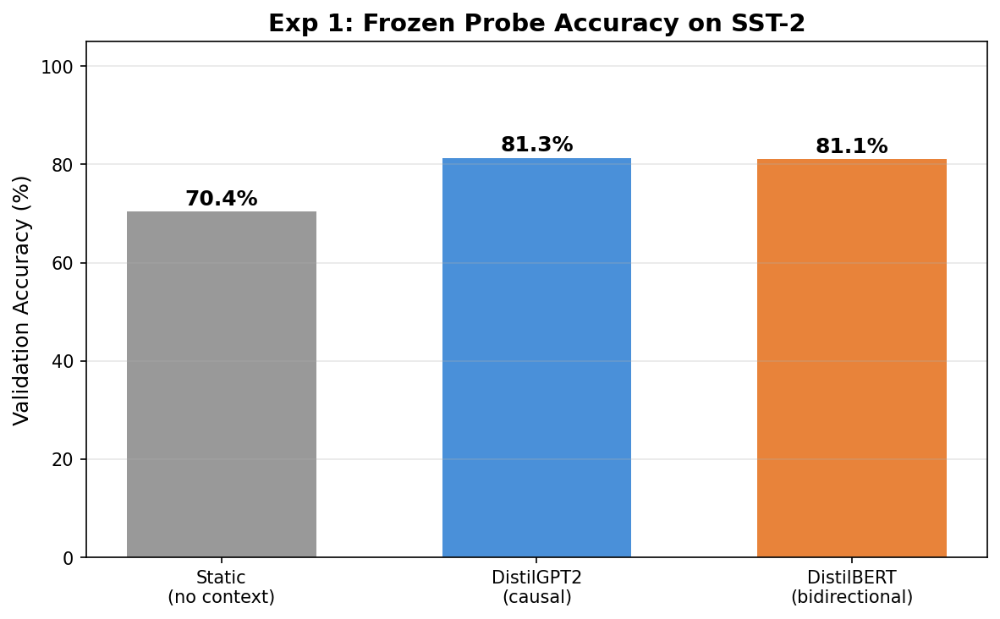

# Experiment 1: Frozen Probe on SST-2 (Centerpiece)

## Question

How much task-relevant information do different encoder types capture in their pretrained representations?

## Setup

- Dataset: SST-2 sentiment classification, 5000 train / 872 val
- Probe: single linear layer → 2 classes, trained for 10 epochs
- All encoders frozen (no gradient through the encoder)
- Three conditions:
  - A: Static embeddings (mean of token embeddings, no Transformer layers)
  - B: DistilGPT2 (causal, last non-pad token hidden state, 82M params)
  - C: DistilBERT (bidirectional, [CLS] hidden state, 66M params)

## Results

| Encoder | Pooling | Val Accuracy |
|---------|---------|-------------|
| Static (no context) | mean of token embeddings | 70.4% |
| DistilGPT2 (causal) | last non-pad token | 81.3% |
| DistilBERT (bidirectional) | [CLS] token | 81.1% |

## Diagnosis

The ordering shows: Static (70.4%) is clearly worse, but **GPT and BERT are virtually tied** (81.3% vs 81.1%). This was **not** the expected result — we predicted BERT would be meaningfully higher.

The explanation is clear: SST-2 is a **sentence-level** task. GPT's last token has already processed the entire sentence left-to-right via causal attention. For the question "is this sentence positive or negative?", the last token's hidden state already encodes sufficient information — it just does so asymmetrically. Bidirectional attention doesn't add much when the question is about the *whole* sentence and the pooling position (last token) has already seen everything.

**This result becomes much more interesting when contrasted with Exp 2 (NER):**

| Task type | DistilBERT | DistilGPT2 | Gap |
|-----------|-----------|-----------|-----|
| Sentence-level (SST-2) | 81.1% | 81.3% | ~0 |
| Token-level (NER F1) | **90.3%** | **68.5%** | **+21.8 pp** |

The bidirectional advantage is **not universal** — it depends on task granularity. For sentence-level tasks, causal is fine. For token-level tasks where each position needs right-context, bidirectional wins dramatically.

**Core insight:** The frozen-probe gap on SST-2 is ~0, which initially seems to contradict "BERT is better for understanding." But it actually reveals something more precise: BERT's advantage is specifically about **per-token representation quality**, not about sentence-level aggregation. GPT's last token is a perfectly good sentence representation — but GPT's *middle* tokens are systematically worse because they can't see rightward context.
