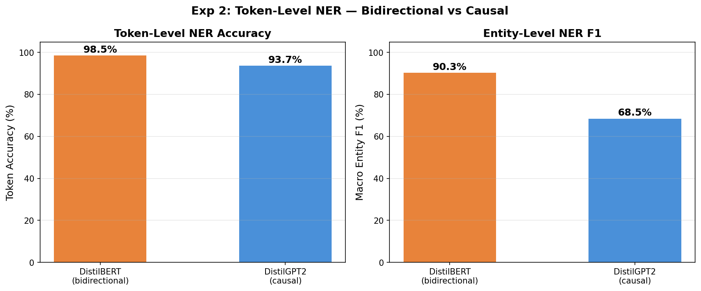
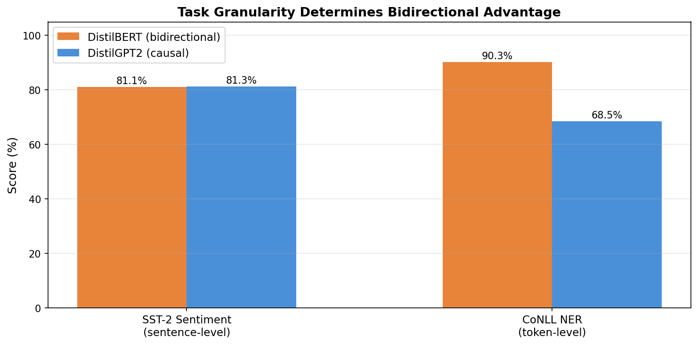

# Experiment 2: Token-Level NER Probe (Key Experiment)

> Question: Does bidirectional context produce measurably better representations for token-level understanding tasks?

## Setup

- Dataset: CoNLL-2003 NER, 5000 train / 1000 val
- Task: Named Entity Recognition (9 labels: O, B/I-PER, B/I-ORG, B/I-LOC, B/I-MISC)
- Both models: full fine-tune, 5 epochs, lr=2e-5, AdamW
- DistilBERT: 66M params, bidirectional attention, token classification head on all positions
- DistilGPT2: 82M params, causal attention, token classification head on all positions
- Subword alignment: only first subword per word gets NER label, continuations get -100 (ignored)

## Results

| Model | Token Accuracy | Macro Entity F1 |
|-------|---------------|-----------------|
| DistilBERT (bidirectional) | **98.5%** | **90.3%** |
| DistilGPT2 (causal) | 93.7% | 68.5% |
| **Gap** | **+4.9 pp** | **+21.8 pp** |

### Per-Entity F1 Breakdown

| Entity type | DistilBERT | DistilGPT2 | Gap |
|-------------|-----------|-----------|-----|
| B-PER | 99.0% | 78.0% | +21.0 |
| I-PER | 98.5% | 96.1% | +2.4 |
| B-ORG | 90.6% | 46.0% | **+44.6** |
| I-ORG | 86.1% | 71.1% | +15.0 |
| B-LOC | 95.6% | 74.3% | +21.3 |
| I-LOC | 84.9% | 67.2% | +17.7 |
| B-MISC | 89.0% | 50.0% | **+39.0** |
| I-MISC | 78.5% | 65.0% | +13.5 |

*The central finding of Lab 4: bidirectional advantage depends on task granularity.*

## Diagnosis

The entity F1 gap of **21.8 percentage points** is crushing — and it's exactly where we predicted the bidirectional advantage would appear.

**Why the gap is so large on NER but zero on SST-2:**

SST-2 is a sentence-level task. GPT's last token has already seen the entire sentence, so it encodes enough information for sentiment classification. But NER is a token-level task: each word must independently be classified as a named entity or not. GPT's causal mask means that a word at position $t$ can only attend to positions $1, \ldots, t$ — it cannot see the words that come *after* it.

**The B- labels expose the problem most clearly:**

- **B-ORG** (entity boundary detection for organizations): DistilGPT2 gets only 46.0% F1. When GPT sees "New" it doesn't know "York Times" follows — it can't distinguish "New York Times" (B-ORG) from "New ideas" (O).
- **B-MISC**: Similar pattern — 50.0% F1. Entity boundaries require right-context.
- **I- labels are less affected** because by the time GPT processes a continuation token, it has already seen the B- token that started the entity.

**Contrast with Exp 1 (SST-2):**

| Task type | DistilBERT | DistilGPT2 | Gap |
|-----------|-----------|-----------|-----|
| Sentence-level (SST-2, accuracy) | 81.1% | 81.3% | ~0 |
| Token-level (NER, entity F1) | **90.3%** | **68.5%** | **+21.8 pp** |

This is the core finding of Lab 4: **bidirectional advantage is not universal — it is task-granularity dependent.** The claim "BERT is better for understanding" needs qualification: BERT is better when every token must independently represent its full context. For whole-sentence aggregation, GPT is equally good.

**Core insight:** The causal mask is a tradeoff. It enables autoregressive generation (Exp 4) but cripples per-token understanding. The bidirectional mask is the opposite tradeoff. Neither is universally better — each is optimized for a different capability.
