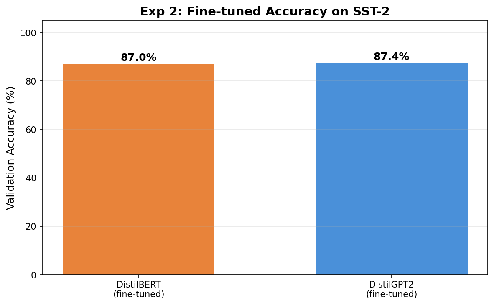

# Experiment 3: Fine-tune Comparison

## Question

Does full fine-tuning close the gap observed in Exp 1's frozen probe?

## Setup

- Dataset: SST-2, 5000 train / 872 val
- Fine-tuning: 3 epochs, lr=2e-5, AdamW with weight decay 0.01
- Batch size: 16
- DistilBERT: fine-tune all layers + linear head, pool from [CLS]
- DistilGPT2: fine-tune all layers + linear head, pool from last non-pad token

## Results

| Model | Frozen Probe (Exp 1) | Fine-tuned (Exp 3) | Improvement |
|-------|---------------------|-------------------|-------------|
| DistilBERT | 81.1% | 87.0% | +5.9pp |
| DistilGPT2 | 81.3% | 87.4% | +6.1pp |

| | Frozen gap | Fine-tuned gap |
|---|-----------|---------------|
| BERT - GPT | ~0pp | ~0pp |

## Diagnosis

Fine-tuning improves both models substantially (~6pp), and both reach ~87%. On SST-2, there is **no meaningful gap** between BERT and GPT — neither frozen nor fine-tuned.

This confirms what Exp 1 already suggested and what Exp 2 (NER) puts in perspective:

1. **On sentence-level tasks, GPT is as good as BERT.** The causal decoder's last token aggregates full-sentence information effectively. Fine-tuning doesn't create a gap that wasn't already there.

2. **The SST-2 parity does NOT mean BERT has no advantage.** Exp 2 shows that on token-level NER, BERT's F1 (90.3%) crushes GPT (68.5%). The advantage is task-dependent.

3. **Together, Exp 1-3 form a task-granularity gradient:**

| Task | Frozen BERT | Frozen GPT | Fine-tuned BERT | Fine-tuned GPT |
|------|-----------|-----------|----------------|----------------|
| SST-2 (sentence) | 81.1% | 81.3% | 87.0% | 87.4% |
| NER (token) | — | — | 90.3% F1 | 68.5% F1 |

**Core insight:** The SST-2 parity is not a failure of the experiment — it is the experiment's most important finding. It forces a precise claim: BERT's bidirectional advantage is specifically about *per-token representation quality*, not about *sentence-level aggregation*. The advantage appears when every token position must independently encode enough information for classification.
