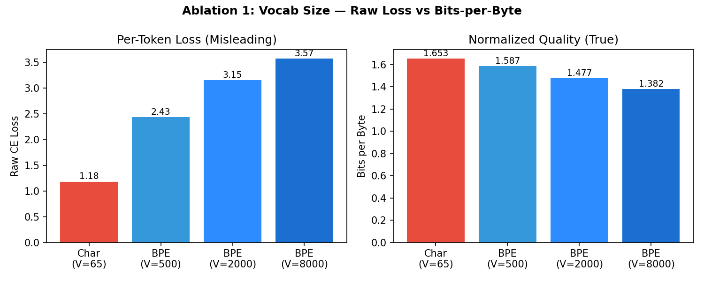
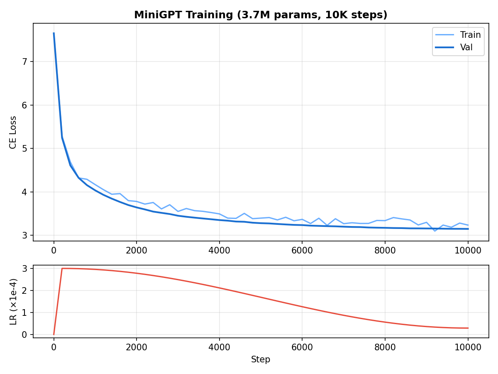
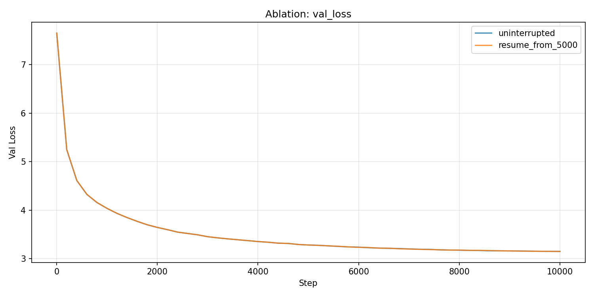
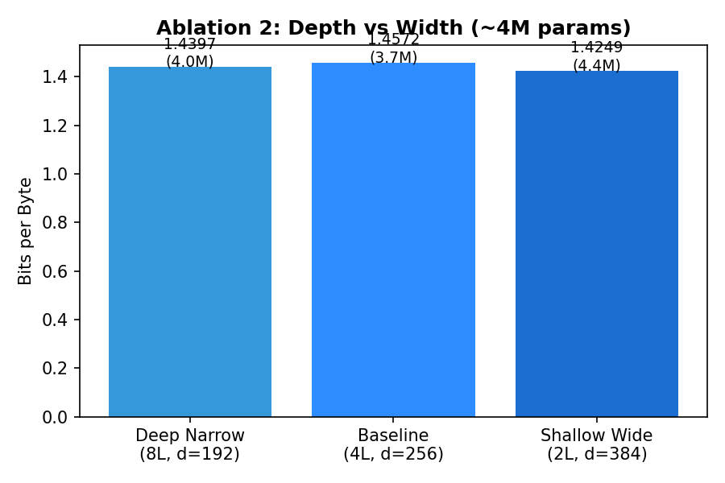
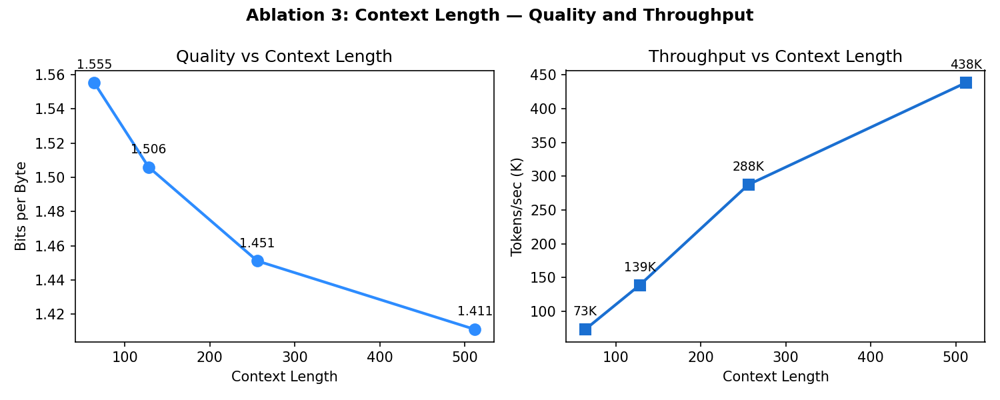
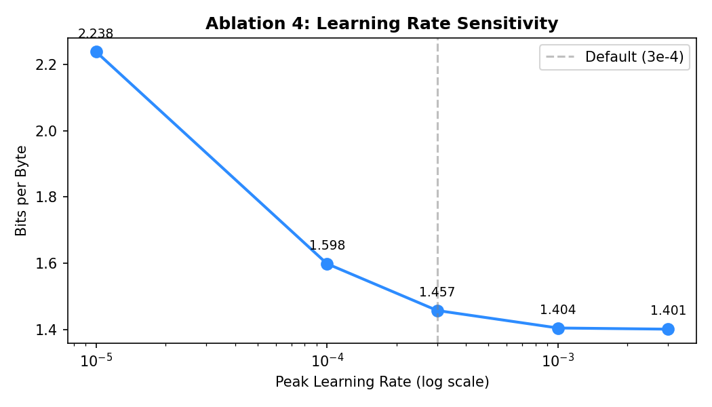

# Project 1 Report: Train a MiniGPT from Scratch

**Date:** 2026-05-18

---

## 1. Architecture

| Parameter | Value |
|-----------|-------|
| Layers | 4 |
| Attention heads | 4 |
| d_model | 256 |
| d_ff | 1024 |
| Context length | 256 |
| Positional encoding | Learned |
| Dropout | 0.1 |
| **Total parameters** | **3,732,992** |

The architecture follows GPT-2's design: pre-LN Transformer blocks, GELU activation, weight-tied embedding/LM head, and GPT-style scaled residual initialization ($\sigma \propto 1/\sqrt{2N}$). Learned positional embeddings were chosen over RoPE because at context length 256, all positions are seen during training and learned PE is simpler.

## 2. Tokenizer Analysis

**Corpus:** 21.4 MB of Project Gutenberg text (15 classic novels including *Les Misérables*, *War and Peace*, *Crime and Punishment*, *Moby Dick*, *Dracula*, *Anna Karenina*, *The Count of Monte Cristo*).

**Tokenizer:** Byte-level BPE trained with HuggingFace `tokenizers`, vocab size 2,000.

| Metric | Value |
|--------|-------|
| Vocabulary size | 2,000 |
| Total tokens | 6,940,287 |
| Bytes per token | 3.08 |

**Documented failure cases:**

- **Numeric splitting:** "1847" → `['1', '8', '4', '7']` (4 tokens). Each digit is a separate token because numbers are rare in literature. This means the model cannot learn digit-level arithmetic patterns.
- **Rare word fragmentation:** "sesquipedalian" → 7 subword tokens. The model is unlikely to reconstruct a coherent representation from these fragments.
- **Multilingual token tax:** Japanese "こんにちは世界" = 12 tokens vs English "Hello World" = 5 tokens. A 2.4x compute cost for the same semantic content.

**Vocab size sweep results (Ablation 1):**

| Tokenizer | Raw Val Loss | Bits-per-Byte | Bytes/Token |
|-----------|-------------|---------------|-------------|
| Char (V=65) | **1.18** (lowest) | **1.653** (worst) | 1.03 |
| BPE V=500 | 2.43 | 1.589 | 2.21 |
| BPE V=2000 | 3.15 | 1.477 | 3.08 |
| BPE V=8000 | 3.57 (highest) | **1.382** (best) | 3.73 |

**The raw loss and bits-per-byte rankings are perfectly reversed.** Char-level appears best by raw loss (1.18 vs 3.57), but after normalizing to bits-per-byte, BPE V=8000 is actually the best model. Raw per-token loss is not comparable across tokenizers because the prediction task difficulty changes with vocabulary size: predicting one of 65 characters is fundamentally easier than predicting one of 8,000 subwords.

## 3. Training

| Metric | Value |
|--------|-------|
| Optimizer | AdamW (β₁=0.9, β₂=0.999, wd=0.01) |
| Peak LR | 3e-4 |
| Schedule | Linear warmup (200 steps) + cosine decay |
| Gradient clipping | max_norm = 1.0 |
| Batch size | 32 |
| Total steps | 10,000 |
| Final train loss | 3.237 |
| Final val loss | **3.149** |
| **Bits-per-byte** | **1.509** |
| Wall time | ~5 min (RTX 4090) |

**Loss curve:**

The loss curve shows three phases: (1) warmup phase (steps 1-200) where loss drops rapidly from 7.65 to ~5.2; (2) main descent (steps 200-8000) with smooth, monotonic decrease; (3) late cosine regime (steps 8000-10000) where LR is very low and loss flattens around 3.15.

Train-val gap is small (3.24 vs 3.15), indicating the 3.7M model is not overfitting on 21MB of text. The model is still in the underfitting regime — more parameters or more training would improve quality.

**No training failures encountered:** no NaN, no loss spikes, no mode collapse. Gradient norms decreased smoothly from ~2.9 to ~1.1 over training.

## 4. Checkpoint and Resume

Checkpoint state includes: model weights, optimizer state, scheduler state, training step, training log, and RNG state.

| Run | Final Val Loss |
|-----|---------------|
| Uninterrupted (10K steps) | 3.1493 |
| Resume (5K → 10K) | 3.1479 |
| **Delta** | **-0.0015** |

The resumed run matches the uninterrupted reference within noise. The small delta (-0.0015) is expected because DataLoader iteration order is not saved, so the exact sequence of training batches differs after resume. Full bitwise-identical continuation would require saving the DataLoader iterator position.

## 5. Generation

Four prompts at three temperatures (0.5, 0.8, 1.2):

**T=0.5 (conservative):** Grammatically correct, repetitive. Tends to loop on high-frequency patterns.

> *"She looked at him and Zossimov, who, then was uneasy, and was not going to see him. 'You know, I'm not afraid of me?' said Svidrigaïlov."*

**T=0.8 (balanced):** Best quality. Produces coherent multi-sentence passages with character names and locations from the training corpus.

> *"The edge of the Rue de Theseigne of Aux-Méran, which was the cemetery, who was still more than M. sur M. de Villefort..."*

**T=1.2 (creative):** More diverse but semantically incoherent. Invents words and breaks grammar.

> *"It was a dark and ignorance at the dressing-room that I must rejoicate my son."*

**Observations:**
- The model has learned character names (Svidrigaïlov, Vronsky, Zossimov) and French place names from *Les Misérables* and *Monte Cristo*.
- At T=0.5, dialogue formatting is mostly correct (quotation marks, "said X").
- At T=1.2, the model occasionally invents plausible-sounding but nonexistent words ("rejoicate", "desphysic").
- A 3.7M model cannot maintain long-range coherence: individual sentences are grammatical but adjacent sentences are semantically unrelated.

## 6. Ablation Experiments

### Ablation 2: Depth vs Width (fixed ~4M params)

| Config | Layers | d_model | Params | BPB | Wall Time |
|--------|--------|---------|--------|-----|-----------|
| Deep narrow | 8 | 192 | 4.0M | 1.440 | 446s |
| Baseline | 4 | 256 | 3.7M | 1.457 | 282s |
| **Shallow wide** | **2** | **384** | **4.4M** | **1.425** | **180s** |

**Finding: At ~4M scale, width wins over depth.** The 2-layer model with d=384 outperforms the 8-layer model with d=192, despite having similar parameter counts. Wider layers give each attention head more capacity (d_head=96 vs 48), and the compositional benefits of depth are not fully realized at this scale with 10K training steps. The shallow-wide model is also 2.5x faster (180s vs 446s) because fewer sequential layers means less overhead.

### Ablation 3: Context Length

| Context | BPB | Tokens/sec |
|---------|-----|-----------|
| 64 | 1.555 | 73K |
| 128 | 1.506 | 139K |
| 256 | 1.451 | 288K |
| **512** | **1.411** | **438K** |

**Finding: Both quality and throughput improve with longer context.** This is counter-intuitive for throughput — attention is O(T²), so longer sequences should be slower. But on a 3.7M model on a 4090, compute is not the bottleneck; GPU utilization is. Longer sequences mean more tokens per batch, better GPU saturation, and higher tokens/sec. Quality improves because each token prediction is conditioned on more prior context.

This relationship will reverse at larger model/context scales where O(T²) attention becomes the true bottleneck.

### Ablation 4: Learning Rate Sensitivity

| Peak LR | BPB | NaN? |
|---------|-----|------|
| 1e-5 | 2.238 | No |
| 1e-4 | 1.598 | No |
| 3e-4 (default) | 1.457 | No |
| 1e-3 | 1.404 | No |
| **3e-3** | **1.401** | **No** |

**Finding: The default LR (3e-4) is not optimal for this model.** Both 1e-3 and 3e-3 produce better results. No LR in the sweep triggered NaN, because gradient clipping (max_norm=1.0) prevents gradient explosions. The sensitivity curve shows diminishing returns above 1e-3 — the 3e-3 vs 1e-3 gap is only 0.003 bpb.

The large gap between 1e-5 and 1e-4 (0.640 bpb) vs the small gap between 1e-3 and 3e-3 (0.003 bpb) suggests that **undertrained is far worse than slightly aggressive**. For a 10K-step budget, erring toward higher LR is the safer choice.

## 7. Reflection

**What would change with 10x compute budget?**

With 100K steps or 30M parameters: (1) use BPE V=8000 since the embedding table would be better trained; (2) increase depth to 8-12 layers since compositional benefits emerge at larger scale; (3) expect long-range semantic coherence to improve; (4) the LR sensitivity curve would shift left — 3e-3 might become unstable at 30M params.

**What concept from Chapters 1-5 was most useful?**

Chapter 5's "bits-per-byte as the true metric" was the single most useful concept. Without it, the vocab sweep would have led to a completely wrong conclusion (char-level best instead of worst). The idea that raw loss is not comparable across tokenizers is unintuitive but critical — it changes how you evaluate every design choice that involves the tokenizer.
